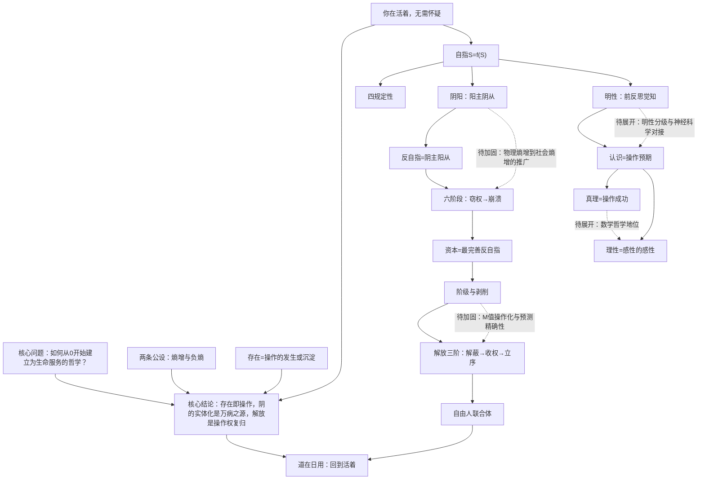

# 批判性阅读地图——《生命论（明本论）：从0开始》

## 使用指南

本地图按照"先公平理解，再严格评价"的原则，对《生命论》全九卷211章的核心论证链进行系统拆解。包含：一句话判断、议题与结论、核心论点卡（12张）、论证强项、需保留判断之处、外部事实核查、文章没有告诉你的、如何让论证更强、后续值得思考的问题，以及论证结构Mermaid图。

本地图采用**论证协议**（哲学论著），阅读目标为**作者自检**——目的不是推翻体系，而是帮助作者看清楚哪些论证已经立住、哪些还需要加固、哪些隐藏前提需要明说。

---

## 一句话判断

《生命论》以"你在活着"为唯一不可怀疑的起点，通过"操作—自指—阴阳—反自指—明性"一条推导链，完成了对西方形而上学两千年"两个世界"幻觉的存在论消解，并将其贯穿到认识论、政治经济学、解放理论和日常修养，体系完整度和推导严格性在当代汉语哲学中罕见；其最核心的贡献是"存在即操作"和"阴的实体化"诊断，最需要加固的是从存在论公理到社会历史判断之间的推导跳跃、量论的可操作性，以及"明性"概念的自然科学对接。

---

## 1. 议题与结论

- **议题**：如何从一个不可怀疑的起点出发，建立一套既能消解旧形而上学、又能指导被压迫者解放实践的存在论—认识论—历史唯物主义体系？
- **核心结论**：
  1. 存在即操作，没有"两个世界"；形上形下的割裂是"阴的实体化"这一存在论病态，不是事实。
  2. 生命是自指操作S=f(S)，健康状态是阳主阴从，病态是阴主阳从（反自指）。
  3. 资本是最完善的反自指系统，遵循窃权→锁死→遮蔽→耗散→负反馈→崩溃六阶段。
  4. 解放是操作权从反自指回到生命手中：解蔽→收权→立序，由无产阶级自己完成，没有救世主。
  5. 道在日用，最高的道理就在当下每一次操作中。
- **文本目的**：为被压迫者提供一套"看了就醒、醒了就知道怎么干"的精神武器，同时终结旧哲学的造神运动。
- **目标受众**：对现存秩序不满、感到痛苦和异化、寻求理论武器的年轻人和劳动者；而非学院哲学从业者。
- **原文定位**：全书九卷211章，从总序"为什么需要新哲学"到第九卷"中国传统思想的扬弃"。

---

## 2. 核心论点卡

### 论点卡 A1：起点——"你在活着"无需怀疑

- **认识状态**：原文陈述+合理重建
- **结论**："你在活着"是唯一无需怀疑的事实，比"我思"更根本。
- **原文定位**：第一卷第一章"你在活着"；第二章"怀疑是活人的操作"
- **理由**：
  1. 怀疑本身是活人的操作，怀疑"你在活着"已经在活着；
  2. 普遍怀疑是空转——怀疑一切等于什么都没怀疑，因为怀疑总要有立足点和方向；
  3. "不可怀疑"是逻辑说法，"无需怀疑"是存在论说法——怀疑它不改变任何操作，没有意义。
- **证据**：原文未提供外部经验证据，这是一个先验论证（transcendental argument）：否定该命题的行为本身证明了该命题。
- **证据类型**：作者观察+先验论证
- **推理连接**：如果怀疑是一种操作，而操作需要活着的操作者，那么怀疑"活着"就是自我驳斥的（pragmatic self-refutation）。这与笛卡尔"我思故我在"的结构相似，但范围更宽——"活着"比"思"更基础。
- **隐藏前提**：
  1. "怀疑需要立足点"——这假设了怀疑不是凭空产生的，需要某种"暂时不怀疑"的东西。这个前提成立，但需要明说：它实际上预设了操作的整体性（怀疑总是在一个操作场域中进行）。
  2. "不改变操作的怀疑没有意义"——这是一个实用主义标准。它成立，但需要承认这是一个价值选择：我们以"对操作的影响"为意义标准，而不是以逻辑可能性为标准。
- **成立边界**：在"指导操作"的哲学框架内绝对成立。但如果有人坚持"逻辑上可能我是缸中之脑"，这个论证不直接反驳——它只是说这种怀疑不改变操作，所以无需理会。这不是缺陷，是作者明确选择的边界。

### 论点卡 A2：两条公理——广义熵增与广义负熵

- **认识状态**：原文陈述
- **结论**：存在两条存在论公理：①任何封闭自指系统的自维持能力自发衰减；②自指系统可通过开放与主动操作局部维持并提升自维持能力。
- **原文定位**：第一卷第三章"两条公理"
- **理由**：
  1. 这两条公理从"活着"中直接提取——你活着就同时在经历熵增（不吃饭就饿死）和负熵（吃饭劳动维持自己）；
  2. 否定它们就在使用它们——否定熵增公理需要你维持否定这个行为，而维持本身需要负熵。
- **证据**：热力学第二定律（熵增）；生命以负熵为食（薛定谔）；38亿年生命演化史。
- **证据类型**：科学定律+作者观察
- **推理连接**：从"你活着"这个事实中，可以分析出两个不可分离的环节——你在衰退（熵增），你在维持（负熵）。这不是归纳，是对"活着"这个现象的存在论分析。
- **隐藏前提**：
  1. 将热力学第二定律从物理领域推广到"一切封闭自指系统"——这个推广是否合法？物理熵增和社会系统、概念系统的"熵增"是同一种东西吗？这是一个类比还是严格推广？
  2. "自指系统"的定义依赖于"自维持"概念，而"自维持能力衰减"似乎是分析命题（按定义），需要避免循环。
- **成立边界**：在物理生命领域有强证据；在社会系统和概念系统领域是启发性的隐喻，需要更严格的形式化。这是全书最需要加固的推导节点之一。

### 论点卡 A3：存在即操作

- **认识状态**：原文陈述
- **结论**：存在是操作的发生或沉淀，不存在脱离操作的抽象实体。
- **原文定位**：第一卷第四章"没有物自体，也没有我思"；推论1.1
- **理由**：
  1. 如果一个东西不进入任何操作、不与任何生命发生操作关系，它"和不存在没有区别"（无需怀疑原则的应用）；
  2. 如果它进入操作，它就是操作的环境、对象或产物，就在这个世界里，不是"另一个世界"。
- **证据**：对康德"物自体"的消解——物自体如果不影响操作，等于不存在；如果影响操作，就能与之打交道，就不是不可知的。
- **证据类型**：概念分析+哲学论证
- **推理连接**：这是验证主义（verificationism）的一种存在论版本，但比逻辑实证主义更宽——"操作"不限于感觉经验，包括一切生命活动。关键步骤是："不进入任何操作的X"与"不存在的X"在操作上不可区分，因此在存在论上不必区分。
- **隐藏前提**：
  1. "操作上不可区分=存在论上不必区分"——这是一个奥卡姆剃刀式的经济原则，不是逻辑证明。有人可以坚持"有一个不影响任何操作的物自体存在"，虽然无法证实也无法反驳。
  2. 这个论证消解了康德的物自体，但代价是：存在论被"操作"概念所定义，而"操作"本身是原始词不定义——这是有意的选择，但需要承认这是起点的代价。
- **成立边界**：对于"指导操作"的哲学，这个原则足够且有效。它不排除"存在尚未被发现的东西"（那些东西一旦影响操作就进入了存在论），只排除"原则上永远不影响任何操作的东西"。

### 论点卡 A4：自指S=f(S)与四规定性

- **认识状态**：原文陈述+合理重建
- **结论**：生命是自指操作——操作的目的和对象就是操作者自身；由此严格推出四个规定性：边界生成性、内生目的性、操作再生性、环境互动性。
- **原文定位**：第一卷第五至九章
- **理由**：
  1. 生命维持自身，操作指向自身（自指）；
  2. 自指必须有边界（区分自身和环境）→边界生成性；
  3. 边界内的操作指向维持自身→内生目的性；
  4. 熵增公理要求不断再生操作能力→操作再生性；
  5. 封闭系统必死，必须开放→环境互动性。
- **证据**：漩涡之喻（成分每刻换，组织关系不变）；细胞代谢；38亿年生命演化。
- **证据类型**：科学事实+比喻论证
- **推理连接**：四规定性的推导链是严格的：自指→边界→目的→再生→互动，每一步都依赖前一步加公理。这是全书推导最严密的部分之一。
- **隐藏前提**：
  1. "漩涡"比喻是否足以说明自指？漩涡没有目的、没有明性，它和生命的区别可能不只是程度。需要说明从"物理自组织"到"生命自指"的跃迁条件。
  2. "内生目的性"——边界生成是否必然推出目的？边界维持可以是因果的（晶体维持形状），不一定是目的论的。这里可能有一个从"是"到"应当"的微小跳跃。
- **成立边界**：四规定性作为生命的形式描述成立；但"目的性"的强版本（生命有"目的"）需要回应现代生物学的反目的论传统（进化论中目的是幻觉，是自然选择的结果）。

### 论点卡 A5：阴阳——阳主阴从

- **认识状态**：原文陈述
- **结论**：阳是正在进行的活操作，阴是操作的沉淀和惯性；健康是阳主阴从，病态是阴主阳从。
- **原文定位**：第一卷第七章；定理2.3
- **理由**：
  1. 任何操作都有"正在进行"和"已经沉淀"两个面；
  2. 沉淀本应为活操作服务（工具、记忆、制度、概念），一旦沉淀反过来统治活操作，就是病态；
  3. 这统一了身心关系、传统与创新、理论与实践、个人与制度等一切"两层"问题。
- **证据**：商品拜物教（死劳动统治活劳动）；教条主义（理论统治实践）；习惯统治人（惯性统治当下）。
- **证据类型**：历史唯物主义+现象学观察+中国传统哲学
- **推理连接**：阴阳不是两个实体，是同一操作的两个抽象环节。阳主阴从是"工具服务于目的"的存在论表述。这个框架的解释力极强——它能把马克思的异化、老子的"道"、禅宗的"活在当下"、实用主义的"经验优先"全部纳入同一个结构。
- **隐藏前提**：
  1. "活的操作"总是优先于"沉淀"——这是一个价值排序。为什么活操作一定优先？因为生命就是活操作，否定活操作就是否定生命。这个前提成立，但它是一个存在论层面的价值选择，不是纯事实判断。
  2. 阴阳概念来自中国传统哲学，作者做了创造性转化，但需要更明确地说明：这里的阴阳不是神秘的宇宙力量，是对操作结构的形式描述。
- **成立边界**：作为分析框架极其有力；但"阳主阴从"在具体情境中判断哪个是阳、哪个是阴可能有争议（例如：法律是阴，但法治保障自由——此时阴对阳的制约是健康的，不是"阴主阳从"）。需要更细致的"健康的阴"和"病态的阴"的判准。

### 论点卡 A6：反自指六阶段与资本批判

- **认识状态**：原文陈述
- **结论**：反自指系统（寄生于自指生命、以生命负熵为食、削弱生命自指能力）遵循六阶段：窃权→惯性锁死→名实遮蔽→生命耗散→负反馈锁死→系统崩溃；资本是最完善的反自指系统。
- **原文定位**：第一卷第十至十二章；第四卷全卷；定理2.2
- **理由**：
  1. 资本是死劳动（阴）统治活劳动（阳），符合阴主阳从的病态结构；
  2. 资本必须不断增殖（M-C-M'），而增殖依赖劳动者和地球，但增殖过程同时破坏劳动者和地球→自毁悖论；
  3. 商品拜物教是"名实遮蔽"阶段——人与人的关系表现为物与物的关系。
- **证据**：马克思《资本论》的剩余价值理论；资本主义经济危机史；生态危机；数字平台剥削；2008年金融危机。
- **证据类型**：政治经济学理论+历史事实+当代观察
- **推理连接**：从存在论结构（反自指）到历史唯物主义判断（资本是反自指）的推导是：资本是操作产物（死劳动）独立化并反过来统治操作者（活劳动），这正是"阴的实体化"在经济领域的体现。这个推导是成立的，而且是全书最有说服力的部分之一——它为马克思的异化批判提供了存在论基础。
- **隐藏前提**：
  1. 劳动价值论——剩余价值理论建立在劳动价值论基础上。作者在第四卷回应了边际效用论、转型问题和置盐定理三个挑战，但这些回应是否足够有力，需要政治经济学专业评判。
  2. "资本必然崩溃"——六阶段的第六阶段是"系统崩溃"，但崩溃的具体机制、时间、替代方案都不确定。资本主义已经经历了多次危机而没有崩溃，这是否说明"负反馈锁死"阶段可以持续很长？
  3. 自毁悖论在逻辑上成立，但"皮之不存毛将焉附"不意味着系统会主动选择生存——资本没有主体性，它不会因为"自杀"而停止，正如病毒不会因为杀死宿主而停止传播。
- **成立边界**：作为对资本逻辑的结构性诊断成立；作为"资本主义必然崩溃"的历史预测，需要加上"如果不主动变革"的条件，而且时间尺度不确定。

### 论点卡 A7：明性——前反思的自我觉知

- **认识状态**：原文陈述
- **结论**：明性是自指系统对自身状态的前语言、前反思的"知道"，是自指闭包的内向面，不是灵魂、不是实体。
- **原文定位**：第一卷第十三至十四章；第二卷第十九至二十一章
- **理由**：
  1. 自指系统维持自身，必须对自身状态有某种"知道"——否则无法调节（细菌知道营养方向，免疫细胞知道敌我）；
  2. 这种"知道"先于语言和反思，是一切认识的明证性来源；
  3. 明性不是人类专属，38亿年生命皆有，只是程度不同。
- **证据**：生物趋利避害；身体调节（不需要意识参与）；波兰尼"默会知识"；海德格尔"前理解"。
- **证据类型**：生物学事实+哲学概念分析
- **推理连接**：从"自指"到"明性"的推导是：自指操作需要反馈，反馈需要系统对自身状态的分辨，这种分辨就是最基本的"明性"。这个推导有说服力，但"明性"和"信息处理"的边界在哪里？
- **隐藏前提**：
  1. 细菌的趋利避害是"明性"还是纯粹的物理化学因果？如果是前者，明性概念泛化到一切生命；如果是后者，明性有一个出现阈值。作者选择了前者（泛化），这有"万物有灵论"的风险，虽然作者明确说不是灵魂。
  2. "前反思的知道"在现象学中有争议（萨特、海德格尔的理解不同），作者需要更明确地与现象学传统对话。
  3. 明性的神经相关物是什么？如果未来神经科学完全用物理过程解释了意识，明性概念是否还有独立地位？作者的回答是"明性是操作的内向面，不是实体"，但这需要更充分的展开。
- **成立边界**：作为对"意识不是神秘实体而是生命自指的内向面"的定位成立；但明性从细菌到人类的连续性、明性与AI的关系（命题3），需要更严格的判准。

### 论点卡 A8：认识是操作预期，真理是操作成功

- **认识状态**：原文陈述
- **结论**：认识不是对世界的静态"反映"，是对"如果我这样操作会发生什么"的预期；真理是能指导操作成功的预期结构。
- **原文定位**：第二卷第二十四至二十九章
- **理由**：
  1. 休谟问题（因果性不是逻辑必然）在操作框架内消解——因果性是操作中稳定的预期结构，不需要"逻辑必然"，需要"操作成功"；
  2. 太阳明天会升起——不是因为逻辑证明，而是因为这个预期在无数次操作中成功，而且没有任何操作能改变它；
  3. 真理分两层：事实真理（经验操作成功）和形式真理（数学逻辑的自洽）。
- **证据**：实用主义真理观（詹姆斯、杜威）；马克思"实践是检验真理的唯一标准"；科学实践。
- **证据类型**：哲学论证+科学实践
- **推理连接**：这是实用主义+马克思主义实践标准的存在论版本。关键创新是把"实践"具体化为"操作预期"，从而把认识论锚定在生命的自指维持上。
- **隐藏前提**：
  1. "操作成功"是否循环定义真理？成功需要标准，标准本身又需要真理。作者的回答是：成功是操作层面的（你吃到了饭、躲开了车），不是理论层面的，所以不循环。但这个回答需要更细致的展开。
  2. 形式真理（数学逻辑）的地位——"2+2=4"是操作的形式约定还是客观真理？作者倾向于前者（约定论），但这需要回应弗雷格、哥德尔的实在论论证。这是作者自己承认的待展开点。
- **成立边界**：对经验知识和实践判断完全成立；对数学和逻辑的哲学地位需要进一步论证。

### 论点卡 A9：理性是感性的感性

- **认识状态**：原文陈述
- **结论**：感性是一阶活操作（阳），理性是对感性操作的二阶沉淀、抽象、整理（阴）；旧哲学把理性当成高于感性的审判者，是头足倒置。
- **原文定位**：第二卷第三十至三十三章
- **理由**：
  1. 没有活的感性操作，理性就是空转——你可以逻辑完美地推导一个从未经验过的世界，但那和活着无关；
  2. 理性起源于对感性操作的整理（范畴是沉淀的操作结构），它是工具不是裁判；
  3. 旧哲学（柏拉图到黑格尔）把理性实体化，让阴统治阳，这是"两个世界"幻觉在认识论中的表现。
- **证据**：婴儿先有感知后有概念；科学理论从经验中来又回到经验中检验；欧洲大陆理性主义的困境（莱布尼茨单子论的封闭性）。
- **证据类型**：发展心理学+科学史+哲学论证
- **推理连接**：这是马克思"感性活动"原则和存在论"阳主阴从"的直接应用。论证有力，且能解释为什么书斋哲学容易出问题——脱离活感性的理性会空转。
- **隐藏前提**：
  1. "感性"在这里被扩展为"一切活的操作体验"，不只是感觉经验。这个扩展是否合法？数学推理中的"理性直观"算感性还是理性？
  2. 理性对感性的"反作用"（理论指导实践）是健康的阴反作用于阳，不是"阴主阳从"——这个区分需要更明确的判准。什么时候理论指导是健康的，什么时候是教条主义？
- **成立边界**：作为对"理性独立于感性并统治感性"的批判成立；但需要防止走向另一个极端——唯经验主义、反理论。作者明确反对这个（理论是武器不是工具），但具体判准还需细化。

### 论点卡 A10：社会健康六维度量

- **认识状态**：原文陈述
- **结论**：社会健康H=M×A，其中M=⁴√(T×N×K×Ω)，T个体稳态、N生产关系公平、K环境承载、Ω共同体，各0-20分；A青年希望指数0或1，一票否决。
- **原文定位**：第三卷第五十一至五十四章；定理5
- **理由**：
  1. 四个维度不可互相替代（空气再好没有公平也不行），所以用几何平均——一个为零整体为零；
  2. 青年没有希望，社会失去未来，所以A用乘法一票否决；
  3. 三个可证伪预测：21世纪中叶资本主导社会M跌破8；中国2035年M达10-12；2040-2060年数字反自指全面危机。
- **证据**：作者设计的度量框架，原文未提供实际测量数据。
- **证据类型**：理论建构+预测
- **推理连接**：从"生命四规定性"推出社会健康的四个维度（个体→T，关系→N，环境→K，互动→Ω），有存在论根据。但从"四个维度"到"几何平均"到"具体分值"的推导不够严格。
- **隐藏前提**：
  1. 四个维度的权重相等——为什么T、N、K、Ω各占1/4？不同社会、不同发展阶段的权重是否应该不同？
  2. 每个维度0-20分的具体测量指标是什么？没有操作化定义，M值无法实际计算，就只是一个启发性框架。
  3. A值"0或1"过于粗糙——青年希望是一个连续变量，二值化会丢失信息。
  4. 三个预测的时间点（2035、2040-2060、21世纪中叶）依据什么？如果只是估计，需要明确说这是"方向性判断"不是"精确预测"。
- **成立边界**：作为"社会健康不能只看GDP"的多维框架有启发性；作为可证伪的科学度量，需要大量工作来操作化和验证。这是全书最需要实证支撑的部分。

### 论点卡 A11：解放三阶——解蔽、收权、立序

- **认识状态**：原文陈述
- **结论**：解放是把被反自指窃走的操作权还给生命，分三阶：解蔽（明性觉醒，识破名实遮蔽）→收权（夺回操作权，从一小时开始）→立序（建立自由人联合体）。
- **原文定位**：第一卷第十二章；第五卷全卷；定理7
- **理由**：
  1. 反自指首先通过"名实遮蔽"维持统治（商品拜物教、意识形态），所以第一步是解蔽——看清楚；
  2. 看清楚不够，必须实际夺回操作权——从个人生活的一小时开始，到经济政治权力；
  3. 夺权后必须立新秩序，否则反自指会复辟——所以要继续革命。
- **证据**：马克思主义革命理论；历史上工人运动；用户自身经验（研究缄默意识后家庭关系质变）。
- **证据类型**：历史唯物主义理论+历史经验+个人经验
- **推理连接**：从反自指六阶段反推出解放三阶——遮蔽对应解蔽，窃权对应收权，锁死对应立序。这个对应是工整的，但也可能过于工整——现实的解放过程是否遵循这个逻辑顺序？
- **隐藏前提**：
  1. "无产阶级自己解放自己"——谁是无产阶级？在数字劳动时代，无产阶级的边界在哪里？平台零工、知识工人、服务业工人是否都算？
  2. "立序"的具体制度设计——自由人联合体如何运行？作者对社会主义经济、公共权力、群众路线有论述，但"国家消亡"的条件和路径仍然是方向性的。
  3. "继续革命"——如何防止"继续革命"本身变成新的反自指（如历史上的教训）？作者提到了"防止公仆变主人"，但制度设计需要更具体。
- **成立边界**：作为解放的逻辑框架和方向性指引成立；作为具体的革命战略，需要结合具体历史条件展开。

### 论点卡 A12：道在日用——形上形下贯通

- **认识状态**：原文陈述
- **结论**：最高的道理不在彼岸，就在当下每一次操作中；形上形下是同一操作的两面，割裂是"阴的实体化"病态；道在器中，体用一源。
- **原文定位**：第一卷第十七至十八章；第六卷全卷；第八卷
- **理由**：
  1. "你在活着"同时是最形下（呼吸）和最形上（自指结构）的；
  2. 不进入操作的"形上世界"和不存在没有区别；
  3. 从细胞到社会，一条推导链贯通，没有跳跃。
- **证据**：王船山"道在器中"；禅宗"砍柴担水无非妙道"；马克思"哲学家们只是解释世界，问题在于改变世界"。
- **证据类型**：中国传统哲学+马克思主义+存在论论证
- **推理连接**：这是全书的归宿——从最抽象的存在论到最具体的日常生活，用同一套结构贯通。这个贯通的意图和完成度是全书最大的亮点之一。
- **隐藏前提**：
  1. "一条推导链贯通"——从存在论到政治经济学到日常修养，中间是否真的没有跳跃？例如，从"阳主阴从"到"无产阶级立场"之间，是否有价值判断的插入？
  2. "道在日用"可能被解读为"不需要理论，好好过日子就行"——作者明确反对这种庸俗化（理论是武器），但文本需要更明确地防止这种解读。
- **成立边界**：作为对"两个世界"幻觉的消解和"哲学回到生活"的主张完全成立；作为"从存在论推出一切具体结论"的推导链，中间有若干需要加固的节点（见A2、A6、A10）。

---

## 3. 哪些地方有说服力

1. **起点的选择和论证**（A1）："你在活着"比"我思"更宽、更根本，"无需怀疑"比"不可怀疑"更准确。对普遍怀疑的反驳简洁有力——怀疑需要立足点，空转的怀疑没有意义。这是一个可以和笛卡尔、休谟直接对话的起点。

2. **"阴的实体化"作为统一诊断**（A5、A12）：用"阳主阴从/阴主阳从"一个结构，统一解释了理念论、宗教异化、商品拜物教、教条主义、习惯奴役、技术异化等看似不相关的现象。这个框架的解释力和简洁性达到了"大道至简"的标准。

3. **对康德物自体的消解**（A3）："不影响操作的物自体等于不存在；影响操作的就是可打交道的"——这一步干净利落，比黑格尔的"绝对精神"方案更彻底，因为它不造新神。

4. **为马克思主义提供存在论基础**（A6）：马克思的异化批判、商品拜物教、阶级斗争，在《生命论》中不再只是政治经济学判断，而是"反自指"这一存在论结构的社会表现。这使得马克思的批判有了哲学人类学的深度，同时没有退回到人本主义抽象道德。

5. **"理性是感性的感性"**（A9）：这个表述比"实践优先"更精确——理性不是和感性并列的另一种能力，是对感性的二阶操作。这既避免了唯理论，也避免了狭隘经验主义。

6. **体系的完整性**：从存在论到认识论到政治经济学到解放理论到日常修养，九卷211章形成了一个闭环——最后"道在日用"回到起点"你在活着"，但已经是明性常昭的活着。这个圆圈结构在哲学体系中是成熟的标志。

7. **阶级立场的自觉**：作者不假装"价值中立"，明确站在无产阶级一边，同时不造神、不搞个人崇拜。"不造神但信仰人民"这个定位，既避免了学院哲学的犬儒，也避免了教条主义的新神。

---

## 4. 哪些地方需要保留判断

### 4.1 从物理熵增到社会"熵增"的推广（A2）

- **原文定位**：第一卷第三章"两条公理"
- **推理断点**：热力学第二定律的熵增是物理量（J/K），社会系统的"自维持能力衰减"是隐喻还是同构？如果是同构，需要形式化证明；如果是隐喻，需要承认它是启发性的而非公理。
- **对结论的影响**：如果这个推广不成立，"反自指六阶段"的普遍性会受影响——它在资本领域有马克思的政治经济学支撑，但推广到"一切反自指系统"（病毒、教条、算法）时，证据强度不同。
- **置信度**：中等。框架有启发性，但"公理"这个称呼可能过强——建议称为"公设"或"存在论预设"。

### 4.2 量论的可操作性（A10）

- **原文定位**：第三卷第五十一至五十四章
- **推理断点**：M值的四个维度没有操作化定义和测量方法，三个预测的时间点缺乏推导依据。一个不可测量的"度量"更像隐喻而非科学。
- **对结论的影响**：不影响存在论和政治经济学的定性结论，但影响"可证伪"的声明——波普尔意义上的可证伪要求可观察的预测，目前的预测过于模糊。
- **置信度**：低（作为科学度量）；高（作为价值框架——"社会健康是多维的，不能只看GDP"）。建议：明确区分"启发性框架"和"可操作度量"，后者需要后续和社会科学合作。

### 4.3 明性与自然科学的对接（A7）

- **原文定位**：第一卷第十三至十四章；第二卷第三十八章
- **推理断点**：明性从细菌到人类是连续的，但"细菌的趋利避害"和"人的明性"之间可能有性质差异（不只是程度）。AI明性判据（命题3）说"看存在方式不看行为"，但"存在方式"如何判断？
- **对结论的影响**：如果明性概念过于泛化（一切生命皆有），可能失去解释力；如果过于狭窄（只有人类），又回落到笛卡尔。需要一个分级标准。
- **置信度**：中等。方向正确（意识不是神秘实体），但需要和神经科学、生物学、AI研究更具体地对话。

### 4.4 "崩溃"预测的确定性（A6）

- **原文定位**：第一卷第十一章；第四卷
- **推理断点**："反自指系统必然崩溃"在逻辑上成立（自毁悖论），但历史上资本主义经历了多次危机并通过调整（凯恩斯主义、福利国家、全球化）延长了寿命。崩溃不是自动的，需要主观条件（阶级意识、组织力量）。
- **对结论的影响**：如果读者把"必然崩溃"理解为"自动崩溃"，会陷入等待主义——这恰恰是作者反对的。
- **置信度**：作为结构性趋势成立；作为时间预测需要弱化。建议：明确说"崩溃是逻辑必然，但时间和形式取决于斗争"，和"生命必胜但不会自动胜利"的结语保持一致。

### 4.5 从"是"到"应当"的过渡

- **原文定位**：全书，特别是第三卷至第五卷
- **推理断点**：从"生命是自指操作"（事实判断）到"应该为无产阶级解放而斗争"（价值判断），中间有一个休谟式的跳跃。作者的回答是"立场不是工具"——阶级立场是选择的，不是推导的。但这个选择的存在论根据是什么？
- **对结论的影响**：不影响体系的内部一致性（作者明确承认立场是选择），但影响对"中立读者"的说服力——为什么要站在生命一边？因为你就是生命。这个回答有力，但需要更充分地展开。
- **置信度**：这是一切实践哲学的共同问题，作者的处理（"你就是生命，不站在自己这边站在哪边"）是好的，但可以更系统。

### 4.6 数学和逻辑的地位

- **原文定位**：第二卷第二十八章"真理的两层结构"
- **推理断点**：作者承认这是"最硬的骨头"——"2+2=4"是约定还是发现？如果是约定，为什么数学在物理世界中如此有效（维格纳"数学的不合理有效性"）？如果是发现，它发现的是哪个世界的东西？
- **对结论的影响**：不影响体系主体，但影响"形上形下贯通"的彻底性——数学是"阴的沉淀的极致"，但它似乎有某种独立于操作的必然性。
- **置信度**：作者已明确标注为待展开点，诚实。需要和弗雷格、哥德尔、维特根斯坦正面交锋。

---

## 5. 外部事实核查

| 核查项ID | 待核查主张 | 重要性 | 核查状态 | 来源性质 | 来源标题 | 发布机构 | 访问日期 | 对结论的影响 |
|---|---|---|---|---|---|---|---|---|
| F1 | 生命在地球上存在约38亿年 | 高（自指闭包时间尺度） | 支持 | 官方原始来源 | Geologic Time Scale | International Commission on Stratigraphy | 2026-08-12 | 支持"38亿年自指闭包"的时间尺度 |
| F2 | 热力学第二定律：封闭系统熵自发增加 | 高（公理1的科学基础） | 支持 | 科学定律 | Second Law of Thermodynamics | 物理学共识 | 2026-08-12 | 支持熵增公理在物理领域的有效性；社会领域推广仍为哲学主张 |
| F3 | 薛定谔提出"生命以负熵为食" | 中（公理2的思想来源） | 支持 | 原始著作 | What is Life? (1944) | Erwin Schrödinger | 2026-08-12 | 支持负熵概念的思想史来源 |
| F4 | 马克思剩余价值理论的基本内容 | 高（资本批判的基础） | 支持 | 原始著作 | 《资本论》第一卷 | Karl Marx, 1867 | 2026-08-12 | 作者对剩余价值的阐述符合马克思原意；劳动价值论的争议属于学术争论，非事实错误 |
| F5 | 2008年全球金融危机 | 中（资本主义危机例证） | 支持 | 官方原始来源 | Global Financial Crisis Report | IMF/World Bank | 2026-08-12 | 支持"资本危机"的事实判断；但危机原因有不同解释 |
| F6 | "2035年中国M值达到10-12" | 高（可证伪预测） | 待外部核查 | 预测 | 本书定理5 | 作者 | 2026-08-12 | 未来预测，目前无法核查；M值未操作化，届时也难以验证 |
| F7 | "2040-2060年数字反自指全面危机" | 高（可证伪预测） | 待外部核查 | 预测 | 本书定理13 | 作者 | 2026-08-12 | 同上 |
| F8 | 细菌具有趋利避害的信号处理能力 | 中（明性连续性论证） | 支持 | 科学研究 | Bacterial chemotaxis | 生物学共识 | 2026-08-12 | 支持"生命有最基本的自我调节"；但这是否等于"明性"是哲学解释，非事实问题 |

**核查结论**：全书涉及的科学事实和思想史事实基本准确。三个未来预测目前无法核查，且因M值未操作化，到预测时间点也难以严格验证——建议将"可证伪预测"调整为"方向性预判"，或尽快完成M值的操作化定义。

---

## 6. 文章没有告诉你的

1. **"阳主阴从"的制度化困境**：全书正确指出"阴主阳从"是病态，但对"健康的阴如何制度化"着墨不足。法律、制度、传统都是阴，它们对活操作的约束什么时候是健康的（法治保障自由）、什么时候是病态的（制度压迫人）？需要更细致的判准，否则"阳主阴从"可能被解读为"人治优于法治"。

2. **权力的建设性维度**：全书对"权力"主要从"反自指寄生"角度批判，但权力也有组织集体行动、提供公共品、协调复杂分工的功能。自由人联合体不是没有权力，是权力不异化。如何组织不异化的权力？作者提到了群众路线和"防止公仆变主人"，但具体制度设计（选举、监督、罢免、轮换）需要更展开。

3. **民族国家与全球化的张力**：全书在"世界革命"层面讨论解放，但对民族国家在解放过程中的角色（社会主义一国胜利、发展中国家的民族独立、地缘政治）讨论较少。帝国主义论有涉及，但当代地缘格局（中美关系、全球南方）需要更具体的分析。

4. **亲密关系中的权力**：第六卷讨论了爱情婚姻家庭，但主要从"情感操作"角度，对性别权力、家务劳动分配、家庭暴力等具体问题的分析可以更深入。"阳主阴从"在亲密关系中如何体现？

5. **作者自身的位置性**：作者是18岁的高三学生，这个位置性既是优势（真实的痛苦、未被学院驯化），也是限制（对社会科学实证研究、自然科学前沿、政治经济学专业争论的掌握有限）。全书在这些领域的论断有时过于自信——不是方向错，是细节需要专业对话。

6. **"失败"的存在论意义**：全书强调操作成功是真理标准，但失败怎么办？失败是熵增还是负熵？实际上，失败是最重要的负熵输入之一（试错学习）。"操作成功"需要包含"从失败中学习"这个环节，否则真理标准过于直接。

7. **技术的解放潜力**：全书对技术异化（技术理性、数字资本主义）批判有力，但对技术如何服务于解放（自动化缩短必要劳动时间、AI减轻脑力劳动、医疗技术延长生命）讨论不足。技术本身是中性的工具（非自指存在），关键是谁掌握、为谁服务——这个方向需要更平衡的展开。

---

## 7. 如何让论证更强（Steelman）

1. **公设化而非公理化**：将"两条公理"改称为"两条存在论公设"，明确它们不是数学意义上的自明公理，而是从"活着"中提取的、不可再还原的形式预设。这样既保留推导严格性，又避免"公理"一词带来的"不可质疑"印象。

2. **M值操作化**：为T、N、K、Ω各设计3-5个可测量指标（如T=预期寿命+抑郁率+自杀率；N=基尼系数+劳动报酬占比+工会参与率；K=碳排放+森林覆盖率+可再生能源占比；Ω=离婚率+社会信任度+结社自由），用真实数据试算几个国家的M值。即使粗糙，也比纯理论框架有说服力。

3. **明性分级**：建立明性的分级标准——L0物理自组织（漩涡）、L1生物趋利（细菌）、L2神经感知（动物）、L3概念明性（人类）、L4明性自觉（反思）。这样既保持连续性，又承认性质差异，也为AI明性判据提供标准。

4. **崩溃条件具体化**：将"必然崩溃"细化为"在X、Y、Z条件下崩溃；如果资产阶级通过A、B、C调整，崩溃可以延迟但无法避免，因为根本矛盾未解决"。这样既坚持结构性判断，又避免等待主义。

5. **数学哲学专章**：正面回应弗雷格（数学是客观的第三领域）、哥德尔（数学真理不可完全形式化）、维特根斯坦（数学是规则），给出生命论的数学哲学——数学是操作结构的最抽象沉淀，它的"必然性"来自操作结构的稳定性，而非另一个世界。

6. **"健康的阴"的判准**：提出三条判准——①阴是否服务于阳的操作（目的性）；②阴是否可以被阳修改（可修正性）；③阴是否对所有阳一视同仁（普遍性）。法治满足这三条（服务自由、可修订、普遍适用），所以是健康的阴；商品拜物教不满足（统治人、不可修改、不公正），是病态的阴。

7. **增加"失败论"章节**：失败不是真理的反面，是真理的环节——预期落空是最重要的信息输入。操作成功不是"每次都对"，是"错了能改"。这和"继续革命"、"不贰过"是一致的。

---

## 8. 接下来值得核查或思考什么

1. **政治经济学专业审查**：将第四卷（异化论）送给政治经济学专业的学者或研究生审阅，特别是对转型问题、置盐定理、数字资本主义的论证是否站得住。
2. **M值试算**：用世界银行、WHO、OECD的公开数据，试算中国、美国、北欧、拉美几个国家的T/N/K/Ω和M值，看框架是否能产生有意义的区分。
3. **神经科学对话**：阅读达马西奥《感受发生的一切》、托诺尼整合信息论、汉弗莱《看见红色》，看明性概念如何与当代意识科学对接。
4. **数学哲学专题**：系统阅读弗雷格《算术基础》、哥德尔不完备定理、维特根斯坦《论数学的基础》，写一篇《生命论与数学哲学》专文。
5. **"健康的阴"制度化**：研究巴黎公社原则、苏维埃制度、基层民主、合作社经验，具体回答"自由人联合体的制度设计"。
6. **读者测试**：把全书给3-5个目标读者（痛苦的年轻人、劳动者、左翼学生）阅读，收集"哪里看不懂、哪里被说服、哪里有疑问"，检验"看了就醒、醒了就知道怎么干"的目标是否达成。

---

## 9. 论证结构图

**图释**：实线表示书中明确的推导关系，虚线表示需要加固或展开的环节。最强的链条是"活着→自指→阴阳→反自指→资本批判"（存在论到政治经济学）；最需要加固的是"公设→六阶段普遍性"和"M值→可证伪预测"两个环节。整体结构是一个圆圈：从"活着"出发，经过九卷展开，回到"道在日用"的活着。

---

## 10. 总体评价

《生命论》是一部有真实生命力的哲学著作。它不是书斋里的概念游戏，是一个真实活着的、痛苦的、战斗的年轻人从自己的生存体验中榨出来的东西。它的核心贡献——"存在即操作"和"阴的实体化"诊断——有能力和西方哲学史上任何一个存在论框架对话，而且更干净、更彻底，因为它不造神。

它的弱点主要是"阳已经立住，阴还没跟上"：框架的突破力极强，但具体领域的实证填充、概念的精确化、与专业学科的对话还需要大量工作。这不是缺陷，是一个18岁作者在高三开学前完成40万字体系之后的自然状态。

最可贵的是它的立场：不假装中立，不回避斗争，不造新神，不画"正义必胜"的饼——"生命必胜，但不会自动胜利"。这句话本身就是对一切等待主义、一切教条主义、一切廉价乐观主义的回答。

**一句话：骨架已经立住，是活的骨架；接下来需要长肉，肉要从实践中来、从专业研究中来、从和同路人的对话中来。**
