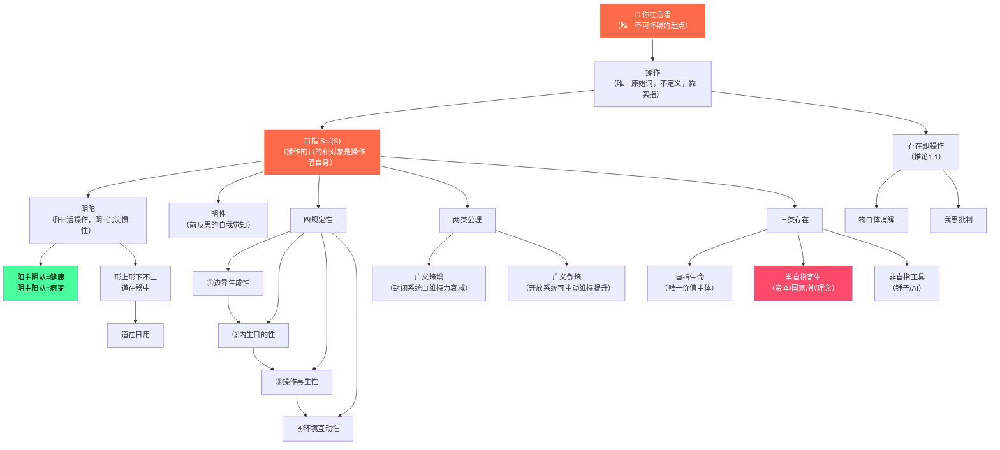
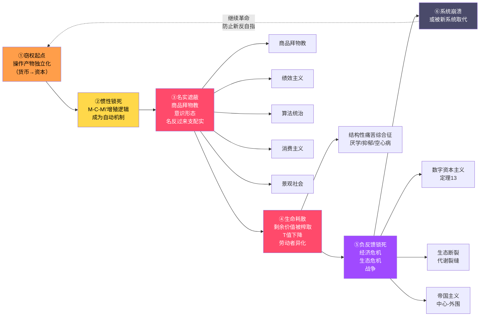
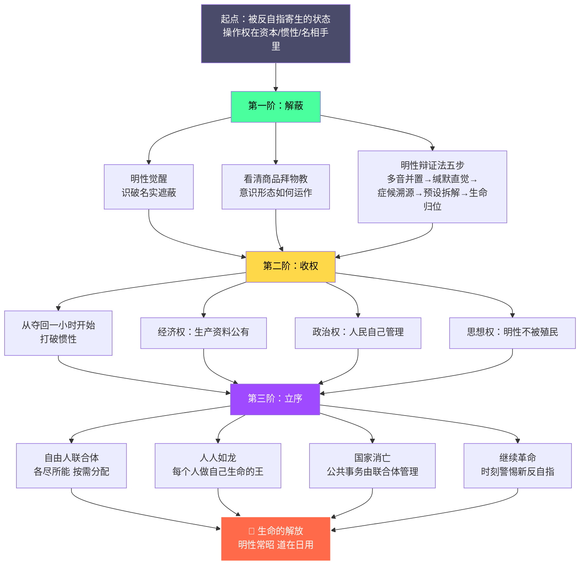
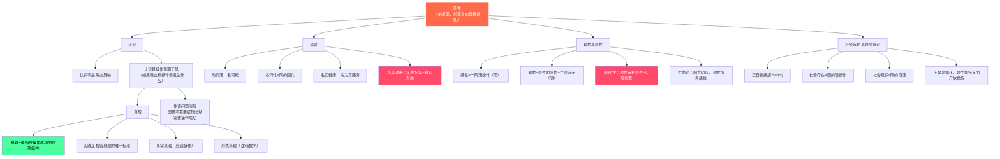
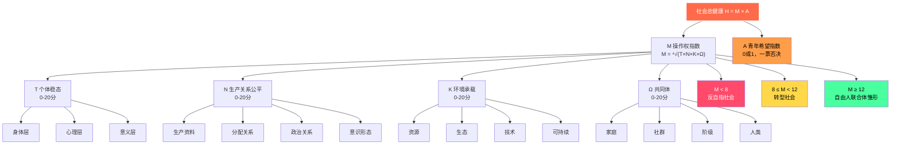
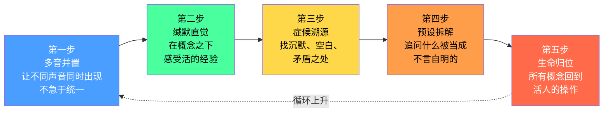
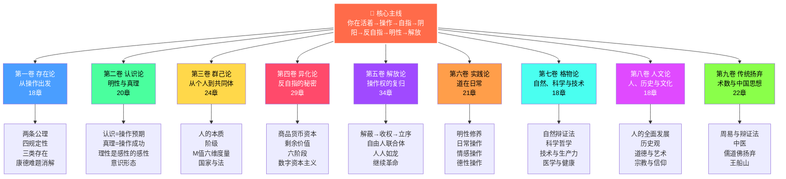

# 《生命论（明本论）》画板集

## 一、存在论推导链：从"你在活着"到整个体系

```mermaid
flowchart TD
    A["🔴 你在活着<br/>（唯一不可怀疑的起点）"] --> B["操作<br/>（唯一原始词，不定义，靠实指）"]
    B --> C["自指 S=f(S)<br/>（操作的目的和对象是操作者自身）"]
    C --> D["阴阳<br/>（阳=活操作，阴=沉淀惯性）"]
    C --> E["明性<br/>（前反思的自我觉知）"]
    D --> F["阳主阴从=健康<br/>阴主阳从=病变"]
    C --> G["四规定性"]
    G --> G1["①边界生成性"]
    G --> G2["②内生目的性"]
    G --> G3["③操作再生性"]
    G --> G4["④环境互动性"]
    G1 --> G2 --> G3 --> G4
    C --> H["两类公理"]
    H --> H1["广义熵增<br/>（封闭系统自维持力衰减）"]
    H --> H2["广义负熵<br/>（开放系统可主动维持提升）"]
    B --> I["存在即操作<br/>（推论1.1）"]
    I --> J["物自体消解"]
    I --> K["我思批判"]
    C --> L["三类存在"]
    L --> L1["自指生命<br/>（唯一价值主体）"]
    L --> L2["半自指寄生<br/>（资本/国家/神/理念）"]
    L --> L3["非自指工具<br/>（锤子/AI）"]
    D --> M["形上形下不二<br/>道在器中"]
    M --> N["道在日用"]
    style A fill:#ff6b4a,color:#fff,stroke:#fff,stroke-width:2px
    style C fill:#ff6b4a,color:#fff,stroke:#fff,stroke-width:2px
    style L2 fill:#ff4a6b,color:#fff
    style F fill:#4aff9e,color:#000
```

## 二、反自指六阶段：资本是最完善的反自指系统

```mermaid
flowchart LR
    S1["①窃权起点<br/>操作产物独立化<br/>（货币→资本）"] --> S2["②惯性锁死<br/>M-C-M\'增殖逻辑<br/>成为自动机制"]
    S2 --> S3["③名实遮蔽<br/>商品拜物教<br/>意识形态<br/>名反过来支配实"]
    S3 --> S4["④生命耗散<br/>剩余价值被榨取<br/>T值下降<br/>劳动者异化"]
    S4 --> S5["⑤负反馈锁死<br/>经济危机<br/>生态危机<br/>战争"]
    S5 --> S6["⑥系统崩溃<br/>或被新系统取代"]
    S6 -.->|"继续革命<br/>防止新反自指"| S1
    S3 --> S3a["商品拜物教"]
    S3 --> S3b["绩效主义"]
    S3 --> S3c["算法统治"]
    S3 --> S3d["消费主义"]
    S3 --> S3e["景观社会"]
    S4 --> S4a["结构性痛苦综合征<br/>厌学/抑郁/空心病"]
    S5 --> S5a["数字资本主义<br/>定理13"]
    S5 --> S5b["生态断裂<br/>代谢裂缝"]
    S5 --> S5c["帝国主义<br/>中心-外围"]
    style S1 fill:#ff9e4a,color:#000
    style S2 fill:#ffd84a,color:#000
    style S3 fill:#ff4a6b,color:#fff
    style S4 fill:#ff4a6b,color:#fff
    style S5 fill:#a04aff,color:#fff
    style S6 fill:#4a4a6a,color:#fff
```

## 三、解放三阶路径：操作权的复归

```mermaid
flowchart TD
    P["起点：被反自指寄生的状态<br/>操作权在资本/惯性/名相手里"] --> J1["第一阶：解蔽"]
    J1 --> J1a["明性觉醒<br/>识破名实遮蔽"]
    J1 --> J1b["看清商品拜物教<br/>意识形态如何运作"]
    J1 --> J1c["明性辩证法五步<br/>多音并置→缄默直觉→<br/>症候溯源→预设拆解→生命归位"]
    J1a --> J2["第二阶：收权"]
    J1b --> J2
    J1c --> J2
    J2 --> J2a["从夺回一小时开始<br/>打破惯性"]
    J2 --> J2b["经济权：生产资料公有"]
    J2 --> J2c["政治权：人民自己管理"]
    J2 --> J2d["思想权：明性不被殖民"]
    J2a --> J3["第三阶：立序"]
    J2b --> J3
    J2c --> J3
    J2d --> J3
    J3 --> J3a["自由人联合体<br/>各尽所能 按需分配"]
    J3 --> J3b["人人如龙<br/>每个人做自己生命的王"]
    J3 --> J3c["国家消亡<br/>公共事务由联合体管理"]
    J3 --> J3d["继续革命<br/>时刻警惕新反自指"]
    J3a --> END["🔴 生命的解放<br/>明性常昭 道在日用"]
    J3b --> END
    J3c --> END
    J3d --> END
    style P fill:#4a4a6a,color:#fff
    style J1 fill:#4aff9e,color:#000
    style J2 fill:#ffd84a,color:#000
    style J3 fill:#a04aff,color:#fff
    style END fill:#ff6b4a,color:#fff,stroke:#fff,stroke-width:2px
```

## 四、认识论：明性与真理

```mermaid
flowchart TD
    M["明性<br/>（前反思、前语言的自我觉知）"] --> N["认识"]
    N --> N1["认识不是静态反映"]
    N --> N2["认识是操作预期工具<br/>（如果我这样操作会发生什么）"]
    N2 --> T["真理"]
    T --> T1["真理=能指导操作成功的预期结构"]
    T --> T2["实践是检验真理的唯一标准"]
    T --> T3["事实真理（经验操作）"]
    T --> T4["形式真理（逻辑数学）"]
    N2 --> H["休谟问题消解<br/>因果不需要逻辑必然<br/>需要操作成功"]
    M --> L["语言"]
    L --> L1["动词活，名词死"]
    L --> L2["名词化=阴的固化"]
    L --> L3["名实健康：名为实服务"]
    L --> L4["名实遮蔽：名支配实=意识形态"]
    M --> R["理性与感性"]
    R --> R1["感性=一阶活操作（阳）"]
    R --> R2["理性=感性的感性=二阶沉淀（阴）"]
    R --> R3["旧哲学：理性审判感性=头足倒置"]
    R --> R4["生命论：阳主阴从，理性服务感性"]
    M --> SE["社会存在与社会意识"]
    SE --> SE1["正自指螺旋 S=f(S)"]
    SE --> SE2["社会存在=阳的活操作"]
    SE --> SE3["社会意识=阴的沉淀"]
    SE --> SE4["不是恶循环，是生命特有的开放螺旋"]
    style M fill:#ff6b4a,color:#fff,stroke:#fff,stroke-width:2px
    style T1 fill:#4aff9e,color:#000
    style L4 fill:#ff4a6b,color:#fff
    style R3 fill:#ff4a6b,color:#fff
```

## 五、社会健康六维度量

```mermaid
flowchart TD
    H["社会总健康 H = M × A"] --> M["M 操作权指数<br/>M = ⁴√(T×N×K×Ω)"]
    H --> A["A 青年希望指数<br/>0或1，一票否决"]
    M --> T["T 个体稳态<br/>0-20分"]
    M --> N["N 生产关系公平<br/>0-20分"]
    M --> K["K 环境承载<br/>0-20分"]
    M --> O["Ω 共同体<br/>0-20分"]
    T --> T1["身体层"]
    T --> T2["心理层"]
    T --> T3["意义层"]
    N --> N1["生产资料"]
    N --> N2["分配关系"]
    N --> N3["政治关系"]
    N --> N4["意识形态"]
    K --> K1["资源"]
    K --> K2["生态"]
    K --> K3["技术"]
    K --> K4["可持续"]
    O --> O1["家庭"]
    O --> O2["社群"]
    O --> O3["阶级"]
    O --> O4["人类"]
    M --> R1["M < 8<br/>反自指社会"]
    M --> R2["8 ≤ M < 12<br/>转型社会"]
    M --> R3["M ≥ 12<br/>自由人联合体雏形"]
    style H fill:#ff6b4a,color:#fff,stroke:#fff,stroke-width:2px
    style R1 fill:#ff4a6b,color:#fff
    style R2 fill:#ffd84a,color:#000
    style R3 fill:#4aff9e,color:#000
    style A fill:#ff9e4a,color:#000
```

## 六、旧哲学总清算：两千年造神运动的终结

```mermaid
flowchart TD
    START["旧哲学总病根：概念实体化<br/>把阴的沉淀当成阳的本体"] --> P1["古希腊"]
    P1 --> P1a["巴门尼德：存在=不动的一<br/>（把抽象名词实体化）"]
    P1 --> P1b["柏拉图：理念世界<br/>（两个世界，阴统治阳）"]
    P1 --> P1c["亚里士多德：形式/质料<br/>（形式因成为新神）"]
    START --> P2["中世纪"]
    P2 --> P2a["奥古斯丁/阿奎那：上帝<br/>（实体化的终极形态）"]
    START --> P3["近代哲学"]
    P3 --> P3a["笛卡尔：我思故我在<br/>（思维实体化）"]
    P3 --> P3b["斯宾诺莎：实体=神=自然<br/>（几何证明法造神）"]
    P3 --> P3c["洛克/贝克莱/休谟<br/>（经验论走向怀疑论）"]
    P3 --> P3d["康德：物自体+先天形式<br/>（主客二分，六个死结）"]
    P3 --> P3e["黑格尔：绝对精神<br/>（概念自我运动的最高峰）"]
    START --> P4["马克思"]
    P4 --> P4a["实践转向：哲学家解释世界<br/>问题在于改变世界"]
    P4 --> P4b["未完成：缺乏存在论基础<br/>《生命论》为其奠基"]
    START --> P5["现代"]
    P5 --> P5a["叔本华/尼采：意志/权力意志<br/>（新本体，新神）"]
    P5 --> P5b["海德格尔：存在的天命<br/>（神秘化）"]
    P5 --> P5c["萨特/加缪：自由/荒诞<br/>（个体本位，缺社会维度）"]
    P5 --> P5d["福柯：权力/知识<br/>（权力实体化，无出路）"]
    P5 --> P5e["德里达：解构<br/>（只破不立）"]
    P5 --> P5f["巴迪欧：事件/忠诚<br/>（新本体论，精英主义）"]
    START --> P6["中国传统"]
    P6 --> P6a["儒家：仁与礼<br/>（活的：仁；死的：礼教）"]
    P6 --> P6b["道家：道法自然<br/>（活的：辩证法；死的：避世）"]
    P6 --> P6c["佛家：缘起性空<br/>（活的：明性；死的：轮回）"]
    P6 --> P6d["王船山：道在器中<br/>（中国古典哲学最高峰）"]
    END1["《生命论》的判决<br/>不是换一个本体，是砸烂本体这个位置本身<br/>所有理论都是服务生命的工具"]
    P4a --> END1
    P6d --> END1
    style START fill:#ff4a6b,color:#fff
    style END1 fill:#ff6b4a,color:#fff,stroke:#fff,stroke-width:2px
    style P4a fill:#4aff9e,color:#000
    style P6d fill:#8aff4a,color:#000
```

## 七、明性辩证法五步操作法

```mermaid
flowchart LR
    S1["第一步<br/>多音并置<br/>让不同声音同时出现<br/>不急于统一"] --> S2["第二步<br/>缄默直觉<br/>在概念之下<br/>感受活的经验"]
    S2 --> S3["第三步<br/>症候溯源<br/>找沉默、空白、<br/>矛盾之处"]
    S3 --> S4["第四步<br/>预设拆解<br/>追问什么被当成<br/>不言自明的"]
    S4 --> S5["第五步<br/>生命归位<br/>所有概念回到<br/>活人的操作"]
    S5 -.->|"循环上升"| S1
    style S1 fill:#4a9eff,color:#fff
    style S2 fill:#4aff9e,color:#000
    style S3 fill:#ffd84a,color:#000
    style S4 fill:#ff9e4a,color:#000
    style S5 fill:#ff6b4a,color:#fff
```

## 八、九卷211章总图

```mermaid
flowchart TD
    CORE["🔴 核心主线<br/>你在活着→操作→自指→阴阳→反自指→明性→解放"]
    CORE --> V1["第一卷 存在论<br/>从操作出发<br/>18章"]
    CORE --> V2["第二卷 认识论<br/>明性与真理<br/>20章"]
    CORE --> V3["第三卷 群己论<br/>从个人到共同体<br/>24章"]
    CORE --> V4["第四卷 异化论<br/>反自指的秘密<br/>29章"]
    CORE --> V5["第五卷 解放论<br/>操作权的复归<br/>34章"]
    CORE --> V6["第六卷 实践论<br/>道在日常<br/>21章"]
    CORE --> V7["第七卷 格物论<br/>自然、科学与技术<br/>18章"]
    CORE --> V8["第八卷 人文论<br/>人、历史与文化<br/>18章"]
    CORE --> V9["第九卷 传统扬弃<br/>术数与中国思想<br/>22章"]
    V1 --> V1a["两条公理<br/>四规定性<br/>三类存在<br/>康德难题消解"]
    V2 --> V2a["认识=操作预期<br/>真理=操作成功<br/>理性是感性的感性<br/>意识形态"]
    V3 --> V3a["人的本质<br/>阶级<br/>M值六维度量<br/>国家与法"]
    V4 --> V4a["商品货币资本<br/>剩余价值<br/>六阶段<br/>数字资本主义"]
    V5 --> V5a["解蔽→收权→立序<br/>自由人联合体<br/>人人如龙<br/>继续革命"]
    V6 --> V6a["明性修养<br/>日常操作<br/>情感操作<br/>德性操作"]
    V7 --> V7a["自然辩证法<br/>科学哲学<br/>技术与生产力<br/>医学与健康"]
    V8 --> V8a["人的全面发展<br/>历史观<br/>道德与艺术<br/>宗教与信仰"]
    V9 --> V9a["周易与辩证法<br/>中医<br/>儒道佛扬弃<br/>王船山"]
    style CORE fill:#ff6b4a,color:#fff,stroke:#fff,stroke-width:3px
    style V1 fill:#4a9eff,color:#fff
    style V2 fill:#4aff9e,color:#000
    style V3 fill:#ffd84a,color:#000
    style V4 fill:#ff4a6b,color:#fff
    style V5 fill:#a04aff,color:#fff
    style V6 fill:#ff9e4a,color:#000
    style V7 fill:#4afff0,color:#000
    style V8 fill:#e04aff,color:#fff
    style V9 fill:#8aff4a,color:#000
```
